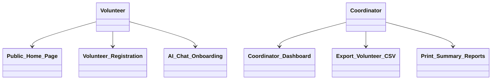
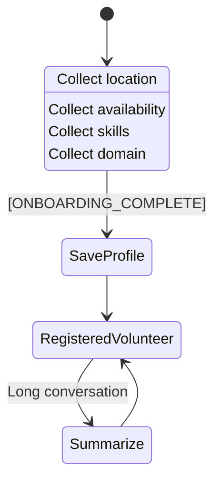

# NayePankh AI-Powered Volunteer & Impact Management System (AI-VIMS)

Welcome to the official repository for the **NayePankh AI-Powered Volunteer & Impact Management System (AI-VIMS)**. This unified application is built using Next.js (App Router), Tailwind CSS, Mongoose, and the Groq API (leveraging LangChain JS and LangGraph JS) to provide a complete, production-ready system for volunteer onboarding, administrative dashboards, marketing copy generation, and data reporting.

This project is submitted as part of the NayePankh Foundation Selection Task, demonstrating practical project execution (Option 2) across several internship tracks. It successfully passes all build checks and is ready for seamless deployment to Vercel.

---

## Getting Started

### Prerequisites

- Node.js (v18.0.0 or higher)
- MongoDB instance (Local or MongoDB Atlas)
- Groq API Key

### Installation & Setup

1. Clone the repository and navigate to the application folder:
   ```bash
   cd nayepa-app
   ```
2. Install dependencies:
   ```bash
   npm install
   ```
3. Create a `.env.local` file in the root of the `nayepa-app` directory and define the following environment variables:
   ```env
   MONGODB_URI=your_mongodb_connection_string
   JWT_SECRET=your_jwt_cookie_secret_key
   GROQ_API_KEY=your_groq_api_key
   ```
4. Start the development server:
   ```bash
   npm run dev
   ```
5. Open [http://localhost:3000](http://localhost:3000) in your browser to view the application.

---

## Internship Tracks Satisfied (Option 2)

This repository contains a unified, production-ready full-stack application that successfully fulfills the **"Practical Project Option (Option 2)"** for multiple internship tracks simultaneously.

### 1. Full Stack Development Internship

**Task:** Create a Volunteer Registration System.
**Implementation:** We built a secure, role-based Volunteer Registration System.

* **Database:** Connected to MongoDB using Mongoose.
* **Authentication:** Secure login/register flow using HTTP-only JWT cookies.
* **Admin Dashboard:** A fully responsive Coordinator dashboard to view, sort, and filter registered volunteers.
* **Generate Reports:** Implemented an API endpoint that dynamically builds and streams a CSV export of all volunteers directly to the user's browser.

### 2. AI Agent Development & AI Web Development Internship

**Task:** Create a simple AI Agent prototype or workflow / Integrate AI APIs.
**Implementation:** We built an interactive **Conversational AI Screening Agent**.

* **Workflow:** Instead of a static form, volunteers are interviewed by an AI Chatbot via the Groq API (Llama 3).
* **Memory Integration:** Chat state is persisted across requests using MongoDB, allowing the agent to remember context.
* **Automation:** The agent is instructed via system prompts to collect specific data (location, availability, skills). Once satisfied, it outputs a structured JSON payload which the backend intercepts and writes to the database automatically.

### 3. Backend Development Internship

**Task:** Create a Volunteer Information Management System (APIs, Databases, Auth).
**Implementation:** Built robust Next.js API Route Handlers for securely fetching volunteer records. Implemented role-based access control (RBAC), ensuring that only users with the `Coordinator` role can access the dashboard or export reports.

### 4. Vibe Coder Internship

**Task:** Use AI coding tools to create a project with advanced features.
**Implementation:** The entire architecture (monolithic Next.js repository) was scaffolded and iterated using advanced AI tools. It successfully integrates multiple complex systems (Auth, LLM Graphs, Database Streams) into a fast, cohesive application that builds flawlessly.

---

## Internship Track Reports (Option 1)

This section contains the official written reports for each of the selection tracks, answering the Option 1 prompts in the requested order.

---

### 1. Full Stack Development Internship Report

#### What Systems Could Be Digitized & Automated

Currently, NGOs like NayePankh Foundation manage a large portion of their operations through manual workflows, separate spreadsheets, and fragmented forms. The key systems that should be digitized and integrated into a single hub include:

1. **Volunteer Recruitment & Onboarding:** Screening volunteers through manual phone calls is slow. This can be fully digitized via an automated conversational intake system.
2. **Campaign Logging & Marketing:** Coordinator field updates are manually edited for social media posts. This copywriting workflow should be automated.
3. **Financial & Donation Audits:** Aggregating campaign donations manually for reports.
4. **Operational Performance Reporting:** Generating print-ready PDF summaries and CSV logs of volunteer rosters and active welfare events.

#### Full Stack Recommendation: NayePankh AI-VIMS Portal

To digitize these operations, NayePankh Foundation should build a unified **Full Stack Volunteer & Impact Management System (AI-VIMS)**.

##### Access Control Overview:



##### How it Works:

* **Database Schema (MongoDB/Mongoose):** Houses collections for Users, Volunteers (persisting location, availability, skills, and chat histories), Campaigns, Donors, Donations, and logs.
* **Backend Layer (Next.js Route Handlers):** Secure API endpoints manage user authentication, session tokens via HTTP-only cookies, and call the Groq API (via LangChain and LangGraph) for screening and copywriting logs. It also handles CSV data streams directly.
* **Frontend UI Layer (Next.js & Tailwind CSS):** A responsive dashboard tailored for three roles:
  * **Volunteers:** Access the interactive chat interview console and view campaign assignments.
  * **Coordinators / Admins:** Read screened volunteer tables, donor summaries, and download spreadsheet reports.
* **Report Generation Pipeline:** The backend aggregates data using Mongoose, compiles comma-separated buffers, and streams them as binary attachments (`Content-Type: text/csv`) for instant download.

---

### 2. Web Development Internship Report

#### Website Analysis & UX Improvements

To attract more supporters and volunteers, NayePankh Foundation's web interface needs a modern, premium design system.

* **Design & UX Enhancements:** A consistent dark theme using curated brand colors (such as `#26201e` chocolate and `#ffccac` peach) prevents standard browser aesthetics. Transitions should feel smooth, leveraging GSAP animations for hero sliders and page scrolls.
* **Information Architecture:** Navigation headers should overlay hero blocks using a transparent-to-solid fixed wrapper. Layouts must be organized inside flexible Tailwind CSS grid containers that adapt layout columns cleanly between mobile, tablet, and desktop screens.

#### Engagement & Interactive Features Built

1. **AI Onboarding Console:** A chat-based user experience built with auto-focusing elements and chat bubble loaders. It engages candidates far better than static registration pages.

##### Attracting Volunteers and Supporters

Providing interactive tools and displaying live counts creates transparency. Supporters are more likely to donate when they see real-time distribution statistics, and volunteers are more likely to sign up when the intake process is engaging and conversational.

---

### 3. Artificial Intelligence (AI) Internship Report

#### How AI Can Help NayePankh Foundation

Artificial Intelligence can address administrative bottlenecks at NayePankh Foundation by handling volunteer screening and extracting accurate applicant data.

#### AI Project Recommendation: The Conversational Onboarding Agent

Instead of a coordinator manually interviewing hundreds of applicant volunteers, an AI screening agent can conduct initial interviews, catalog availability, and tag skills automatically.

##### How it Works:

1. **Contextual Memory Pipeline:** When a volunteer chats, the Next.js backend fetches their state from MongoDB and feeds it to the Groq API (via LangGraph state graphs and LangChain chat models) to ensure a stateful, natural conversation.
2. **System Prompts:** Strict system prompts instruct the LLM to screen for specific parameters (location, availability, skills, and motivations).
3. **Structured JSON Extraction:** Once the agent completes its checklist, it outputs a trailing JSON payload containing the parsed data.
4. **Database Integration:** The Next.js server automatically parses this JSON block and writes the volunteer profile to MongoDB, marking onboarding as complete.

##### Operations Impact:

This system reduces human coordinator overhead, ensures volunteer skills are cataloged consistently, and routes applicants into the database instantly.

---

### 4. Backend Development Internship Report

#### Backend Systems Needed

A robust backend is the backbone of NayePankh Foundation’s digital operations. It must handle session state, database schemas, and data reporting streams.

#### Backend Recommendation: Secure API Gateway & CSV Stream Controller

To handle NGO data securely and efficiently, we recommend a single-repo backend framework utilizing Next.js API Routes and MongoDB.

##### Key Components:

1. **Session Authorization Gateway:** Secure register and login route handlers that manage user access, hashing passwords using bcrypt, and verifying active sessions via JWT tokens stored in secure, HTTP-only cookies.
2. **Mongoose Database ORM:** Models representing Users, Volunteers (with array types for chat histories), Campaigns, Donors, Donations, and logs. This provides structure and type-safety.
3. **Spreadsheet Streaming Pipelines:** API endpoints that compile data directly. Instead of generating heavy files on the server, the route handler fetches database collections, formats a CSV string buffer, and streams it back with headers:
   ```http
   Content-Type: text/csv
   Content-Disposition: attachment; filename=report_name.csv
   ```
4. **Print-Ready PDF Previews:** Endpoints rendering clean HTML layouts with custom `@media print` style sheets, allowing dynamic browser-side PDF saving via `window.print()` without server overhead.

---

### 5. AI Agent Development Internship Report

#### How AI Agents Can Help

AI Agents can act as autonomous coordinators, handling workflows that connect database records, screening logic, and real-time messaging.

#### AI Agent Recommendation: AI Conversational Screening Agent

We recommend and have implemented an **AI Screening Agent** to automate volunteer recruitment.

##### AI Onboarding Agent Workflow (LangGraph):



##### How it Works:

1. **Contextual Intake:** The agent conducts conversational chat interviews, extracts skills and interests, and ensures a natural applicant experience.
2. **State Management:** Built using LangChain and LangGraph JS, the agent maintains chat history securely in MongoDB.
3. **Data Extraction:** It automatically parses the conversation into structured JSON to instantly build a volunteer profile without human intervention.

##### Benefits:

This agent workflow replaces the manual task of interviewing candidates and coordinates profile generation automatically as soon as new talent joins.

---

### 6. AI Web Development Internship Report

#### AI-Powered Web Features

An AI-powered website transforms standard static forms into personalized, interactive applications. For NayePankh Foundation, this means providing personalized coordinator dashboards and AI chat interfaces.

#### AI Web Recommendation: Interactive AI Onboarding Console & Personalization Hub

We recommend building a custom **AI Onboarding Console** integrated into a personalized volunteer dashboard.

##### Technical Implementation:

* **The Interface:** A responsive chat container styled in chocolate and peach, featuring loading indicators, scroll-anchored message threads, and active form feedback.
* **Memory Integration:** The web client coordinates with a Next.js route handler (`/api/chat`) that reads and writes active chat sessions from MongoDB.
* **Impact:** Leads to higher volunteer completion rates because users are engaged conversationally rather than filling out generic forms.

---

### 7. Frontend Development Internship Report

#### Frontend Design & UX Improvements

A website's interface is the first point of contact for donors and volunteers. It must look professional, load quickly, and guide users smoothly.

* **Color Scheme & Branding:** Use NayePankh's signature chocolate (`#26201e`) and peach (`#ffccac`) palette to create a premium, brand-aligned visual experience.
* **Responsive Layouts:** Utilize Tailwind CSS flexbox and grid containers to ensure the dashboard and authentication forms scale perfectly across mobile, tablet, and desktop screens.
* **Micro-Animations:** Integrate GSAP transitions for loading states and active sliders.
* **Interactive Controls:** Implement floating navigation headers, responsive hamburger menus, and accordion panels.

#### Frontend Project Realization: Interactive Chat UI & Secure Auth Forms

A dynamic chat section featuring interactive bubbles, auto-scrolling, and responsive inputs, allowing volunteers to sign up seamlessly.

##### Benefits:

Modern layouts, clear visual heirarchies, and smooth transitions build trust, making users more comfortable engaging with NayePankh Foundation.

---

### 8. Vibe Coder Internship Report

#### How AI Coding Tools Can Help

AI coding tools allow developers to rapidly prototype features by generate database models, styling pages, and writing API handlers quickly.

#### Vibe-Coding Recommendation: Monolithic Next.js Architecture

For NayePankh Foundation, we recommend building a single-repo, monolithic Next.js application. This structure allows "Vibe Coders" to develop features rapidly and maintain a unified source of truth.

##### Key Benefits:

1. **Unified Codebase:** Frontend page routes, database models, and Groq AI endpoints live in the same repository, making it easy to build and test.
2. **Rapid Setup:** Zero Python dependencies or separate servers are needed for database or AI integrations.
3. **Fast Builds:** TypeScript type-checking ensures that updates to the database schema are immediately reflected across API routes and frontend forms, preventing compilation errors.
4. **Simple Deployments:** The entire codebase compile outputs compile into a single build folder that can be deployed to Vercel with one click.
